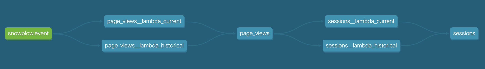
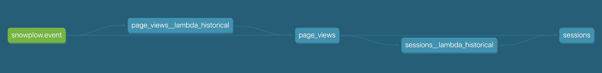

# Lambda views

## Option 1:
Implement this without any macros.




Things to note:
- Use of the `run_started_at` [variable](https://docs.getdbt.com/reference/dbt-jinja-functions/run_started_at/)
- We've added some meta fields to make debugging easier

Pros:
- Relatively easy to intuit what's going on

Cons:
- SQL is re-used — two models have the transformation SQL (e.g. `page_views_current` and `page_views_historical`), and the SQL in the models that union together the two relations are very similar
- Very brittle — have to remember to materialize each model appropriately

## Option 2
Use macros to reduce duplicated code:
- Use a macro, `<model_name>_sql.sql` for the transformation SQL
- Use macros, `lambda_filter` and `lambda_union` to template the `where` clauses and the `union` model



Things to note:
- Removed the `__lambda_current` views, since you don't strictly need to materialize those in your warehouse
- Optional var, `lambda_split`, that can be overridden for the cutoff time
- Added logic for a unique key (though that may have performance impacts)
- The `lambda_filter` macro relies on the model having a matching column in both the source and target table:
```sql
where {{ column_name }} >= (select max({{ column_name }}) from {{ this }})
    and {{ column_name }} < '{{ filter_time }}'
```

Pros:
- Less duplicated code
- Less chance of silly mistakes
- Fewer objects materialized in the warehouse

Cons:
- Harder to reason about — the model code lives separately to the models


## Thought experiment
Use a custom materialization

**Note: This doesn't actually work**
## Alt-alt approach: custom materialization??

I've included a mockup in `models/thought_experiment_only`. As the name suggests, this is only a thought experiment.

**Pros:**
* We can  _both_ keep model SQL within the model file _and_ write that SQL only once

**Cons:**
* It obfuscates a _lot_ of logic into the materialization layer

**Challenges:**
* How to pass `config` values down to the historical model? Namely `materialization` (table or incremental), `schema`, `alias`
* How to "call" one materialization from another? We don't want to copy+paste all the logic from every adapter's `incremental` materialization into a new `lambda_view` materialization
* Will dbt break in new and interesting ways if it creates multiple objects in a database for one model?
